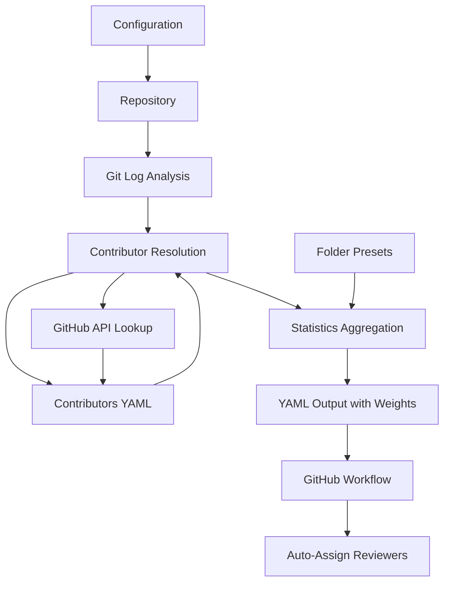

# CodeOwners Generator - Technical Documentation

A comprehensive tool for analyzing Git repositories to extract commit history, index contributors, summarize changes, and generate CODEOWNERS files automatically.

## Table of Contents
1. [Overview](#overview)
2. [What's New in Version 0.0.5](#whats-new-in-version-005)
3. [Architecture](#architecture)
4. [Installation](#installation)
5. [Configuration](#configuration)
6. [Usage](#usage)
7. [Workflow](#workflow)
8. [Troubleshooting](#troubleshooting)
9. [API Reference](#api-reference)
10. [Maintenance](#maintenance)

## Overview

The CodeOwners Generator analyzes Git repositories to determine code ownership based on commit history and contributor activity. It uses the GitHub API to gather information about contributors and their commit patterns, then generates CODEOWNERS files that assigns ownership to repository folders based on actual contribution data.

### Key Features
- **Automatic Contributor Discovery**: Identifies and resolves contributors from Git history
- **GitHub Integration**: Uses GitHub API to enrich contributor information
- **Flexible Folder Configuration**: Supports different folder types and ownership rules
- **Weighted Owner Assignment**: Assigns numeric weights to owners based on contribution metrics
- **Hierarchical Analysis**: Processes repository structure top-down
- **Rate Limit Handling**: Implements exponential backoff for API requests
- **Persistence**: Saves contributor data for incremental updates
- **GitHub Actions Workflow**: Automatic reviewer assignment for pull requests
- **YAML Output Format**: Structured output with contribution weights for easy integration

## What's New in Version 0.0.5

### Major Changes

#### 1. Weighted Owner Format (Breaking Change)
The `folder_presets.yaml` format has been updated to use weighted owners instead of simple lists.

**Old Format (v0.0.4):**
```yaml
/tests/dash:
  owners:
    - congh
    - nikamirrr
  type: CLOSED_OWNERS
```

**New Format (v0.0.5):**
```yaml
/tests/dash:
  owners:
    congh: .inf
    nikamirrr: .inf
  type: CLOSED_OWNERS
```

**Migration:** Update your `folder_presets.yaml` files to use the dictionary format with weights. Use `.inf` for highest priority owners or numeric values for relative weighting.

#### 2. YAML Output Format with Contribution Weights
The tool now outputs a YAML file with contribution weights instead of plain owner lists.

**New Output:**
```yaml
/:
  owner1: 1505
  owner2: 892
  owner3: 678
/src/:
  owner1: 2000
  owner4: 453
```

**Benefits:**
- Quantifies contribution levels for each owner (total changed lines)
- Enables data-driven reviewer selection
- Provides transparency in ownership calculations
- Supports integration with automated workflows
- Weights are integers representing actual line change counts from Git history

#### 3. GitHub Actions Workflow for Auto-Reviewer Assignment
New workflow files enable automatic reviewer assignment for pull requests.

**New Files:**
- `workflow_scripts/assignReviewers.yaml` - GitHub Actions workflow configuration
- `workflow_scripts/auto-assign.py` - Intelligent reviewer selection script

**Features:**
- Automatic trigger on pull request creation
- BFS algorithm for hierarchical reviewer search
- Configurable reviewer count and tie-breaking
- Respects code ownership hierarchy

**Setup:**
```bash
cp workflow_scripts/assignReviewers.yaml .github/workflows/
cp workflow_scripts/auto-assign.py .github/.code-reviewers/
codeowners-cli --repo . > .github/.code-reviewers/pr_reviewer-by-files.yml
```

### Breaking Changes
⚠️ **Folder Presets Format:** Existing `folder_presets.yaml` files must be updated to use the new weighted dictionary format.

### Upgrade Path
1. Update `folder_presets.yaml` to use weighted owner format
2. Review and test YAML output format compatibility with your tooling
3. Optionally deploy GitHub workflow for auto-assignment
4. Regenerate contributor and reviewer index files

## Architecture

The tool follows a multiphase processing approach:



### Core Components
- **AsyncGitHubRepoSummary**: Main analysis engine with GitHub API integration
- **ContributorCollection**: Manages contributor data and persistence
- **FolderSettings**: Handles folder type configuration and inheritance
- **Organization Classification**: Automatically categorizes contributors by organization

## Installation

### Prerequisites
- Python 3.8 or higher
- Git repository with commit history
- GitHub API access (optional but recommended)

### Quick Start
```bash
# Clone the repository
git clone <repository-url>
cd code-owners

# Install the package
pip install -e .

# Set up GitHub tokens (recommended)
export GITHUB_API_TOKENS="github_pat_XXXXX,github_pat_YYYYY"

# Run the tool
codeowners-cli --repo /path/to/repo --contributors-file contributors.yaml
```

### Building from Source
```bash
# Install build dependencies
pip install build

# Build the package
python -m build

# Install the built package
pip install dist/*.whl
```

## Configuration

### GitHub API Tokens

Without GitHub tokens, the tool is limited to 60 API requests per hour. For larger repositories, provide multiple tokens:

```bash
export GITHUB_API_TOKENS="token1,token2,token3"
```

**Token Requirements:**
- Fine-grained personal access tokens
- Public repository access (minimum)
- No additional scopes required

### Configuration Files

#### Contributors File (`contributors.yaml`)
Stores contributor information including:
- GitHub ID and login
- Email addresses (multiple per contributor)
- Organization affiliation
- Commit history and timestamps

**Example:**
```yaml
- available_to_review: true
  commit_count: 45
  emails:
    - john.doe@company.com
    - john.doe@gmail.com
  github_id: 123456
  github_login: johndoe
  last_commit_ts: 2024-01-15 10:30:00+00:00
  name: John Doe
  organization: MSFT
```

#### Folder Presets File (`folder_presets.yaml`)
Defines folder-specific settings:
- Folder types (IGNORE, CLOSED_OWNERS, OPEN_OWNERS, REGULAR)
- Pre-defined owners with weights
- Inheritance rules

**Format:** Owners are specified as a dictionary mapping GitHub usernames to weights. Use `.inf` for infinite weight (highest priority) or numeric values for relative importance.

**Example:**
```yaml
/.git:
  type: IGNORE
/tests/dash:
  owners:
    congh: .inf
    nikamirrr: .inf
  type: CLOSED_OWNERS
/tests/ntp:
  owners:
    nikamirrr: .inf
  type: OPEN_OWNERS
/docs:
  owners:
    tech_writer: 100.5
    maintainer: 75.0
  type: OPEN_OWNERS
```

**Owner Weights:**
- `.inf`: Infinite weight - highest priority, always included
- Integer or float values (e.g., `100`, `50.5`): Manually assigned relative weight for prioritization
- Owners with higher weights are prioritized when selecting code owners
- Note: Calculated weights from commit history are always integers (line change counts), but manual preset weights can be floats

## Usage

### Basic Usage
```bash
codeowners-cli --repo /path/to/repo --contributors-file contributors.yaml
```

### Advanced Configuration
```bash
codeowners-cli \
  --repo /path/to/repo \
  --contributors-file contributors.yaml \
  --folder_presets_file folder_presets.yaml \
  --active_after 2024-01-01 \
  --max_owners 5 \
  --log_level debug
```

### Output Format

The tool outputs a YAML file mapping folder paths to owners with their contribution weights. This format can be used to generate CODEOWNERS files or integrate with GitHub workflows.

**Output Structure:**
```yaml
/:
  owner1: 1505
  owner2: 892
  owner3: 678
/src/:
  owner1: 2000
  owner4: 453
/tests/:
  owner2: 1200
  owner5: 987
```

**Weight Values:**
- Integer values represent the total number of changed lines (additions + deletions) for each owner
- Higher values indicate more significant contributions to that folder
- `.inf` may appear for preset owners with infinite priority (from folder_presets.yaml)
- Weights are automatically calculated from commit statistics and Git history

**Converting to CODEOWNERS Format:**
The YAML output can be transformed into GitHub CODEOWNERS format:
```
/ @owner1 @owner2 @owner3
/src/ @owner1 @owner4
/tests/ @owner2 @owner5
```

## Workflow

The CodeOwners Generator follows this workflow:

### Phase 1: Initialization
1. **Load Configuration**
   - Load existing contributors from `contributors.yaml` (if exists)
   - Load folder presets from `folder_presets.yaml` (if exists)
   - Scan repository structure and map folders to presets

2. **Repository Analysis**
   - Walk through repository directory tree
   - Identify all folders and their relationships
   - Apply preset configurations

### Phase 2: Commit Processing
1. **Extract Commit History**
   - Use `git log --numstat` to get commit statistics
   - Parse author information (name, email, timestamp)
   - Calculate change counts per folder

2. **Contributor Resolution**
   - Match commits to existing contributors by email
   - Query GitHub API for unknown contributors
   - Handle GitHub noreply emails (e.g., `29677895+user@users.noreply.github.com`)
   - Create bundled contributors for unresolved emails (`github_id: -1`)

### Phase 3: Analysis and Generation
1. **Folder Statistics**
   - For each active contributor (commits after `--active_after`)
   - Aggregate change statistics per folder
   - Propagate statistics up the folder hierarchy
   - Respect IGNORE and CLOSED_OWNERS folder types

2. **CODEOWNERS Generation**
   - Process folders top-down using depth-first search
   - Select top contributors up to `--max_owners` limit
   - Apply folder type rules (REGULAR, OPEN_OWNERS, CLOSED_OWNERS)
   - Generate hierarchical CODEOWNERS output

### Folder Type Processing Rules

| Type            | Description                | Behavior                                                          |
|-----------------|----------------------------|-------------------------------------------------------------------|
| `IGNORE`        | Skip folder and subfolders | Excluded from analysis, no statistics collected                   |
| `CLOSED_OWNERS` | Fixed owner set            | No new owners added, statistics still propagate to parent folders |
| `OPEN_OWNERS`   | Flexible owner set         | New owners can be added up to `--max_owners` limit                |
| `REGULAR`       | Default type               | Standard analysis and ownership assignment                        |

### Phase 4: GitHub Workflow Integration

The tool includes GitHub Actions workflows for automatic reviewer assignment on pull requests.

**Components:**
1. **`assignReviewers.yaml`** - GitHub Actions workflow configuration
2. **`auto-assign.py`** - Python script for intelligent reviewer selection

**Workflow Features:**
- Triggers on pull requests to `master`, `main`, or release branches (e.g., `202[0-9][0-9][0-9]`)
- Analyzes changed files to determine appropriate reviewers
- Uses BFS (Breadth-First Search) to find reviewers from changed paths up to repository root
- Supports configurable reviewer count and tie-breaking logic
- Respects the code ownership hierarchy

**Configuration:**
```yaml
REVIEWER_INDEX: .github/.code-reviewers/pr_reviewer-by-files.yml
NEEDED_REVIEWER_COUNT: 3
INCLUDE_CONTRIBUTORS_TIES: True
```

**How It Works:**
1. Workflow triggers on pull request creation/update
2. Script analyzes all changed files in the PR
3. For each changed file, traverses up the directory tree to find matching owners
4. Uses BFS to collect reviewer candidates from the folder hierarchy
5. Ranks candidates by contribution count
6. Selects top reviewers (optionally including tied contributors)
7. Automatically requests reviews from selected users

**Reviewer Selection Algorithm:**
- Start with most specific folder paths for changed files
- If insufficient reviewers, traverse up to parent folders
- Accumulate reviewer scores across all relevant folders
- Optionally include all reviewers with tied contribution scores
- Ensures diverse representation when changes span multiple areas

## Troubleshooting

### Common Issues

#### Rate Limiting
**Problem:** "GitHub rate limit exceeded" errors
**Solution:** 
- Add GitHub API tokens: `export GITHUB_API_TOKENS="token1,token2"`
- Use multiple tokens for larger repositories
- The tool implements exponential backoff automatically

#### Missing Contributors
**Problem:** Contributors with `github_id: -1`
**Solution:**
- Review `contributors.yaml` for duplicate emails
- Manually merge contributor records
- Re-run the tool

#### Performance Issues
**Problem:** Slow processing on large repositories
**Solution:**
- Increase number of GitHub tokens
- Use `--active_after` to limit commit history
- Consider using `--max_owners` to reduce processing

#### SSL/TLS Issues
**Problem:** Certificate verification errors
**Solution:**
- The tool uses `certifi` for certificate validation
- Ensure system certificates are up to date
- Check network proxy settings if applicable

#### GitHub Workflow Issues
**Problem:** Workflow fails to assign reviewers
**Solution:**
- Check workflow logs in GitHub Actions tab
- Verify `REVIEWER_INDEX` file exists and has correct format
- Ensure repository has `pull-requests: write` permission
- Verify reviewers exist in the repository (not external users)

**Problem:** Wrong reviewers assigned
**Solution:**
- Regenerate reviewer index file with latest contributor data
- Review folder presets for correct owner weights
- Check BFS traversal logic matches your repository structure
- Adjust `NEEDED_REVIEWER_COUNT` if too many/few reviewers

**Problem:** Workflow not triggering
**Solution:**
- Verify workflow file is in `.github/workflows/` directory
- Check branch name matches trigger patterns
- Ensure pull request targets correct base branch
- Review workflow permissions in repository settings

### Debug Mode
Enable debug logging to troubleshoot issues:
```bash
codeowners-cli --repo /path/to/repo --log_level debug
```

## API Reference

### Command Line Options

| Option                  | Type   | Default             | Description                                  |
|-------------------------|--------|---------------------|----------------------------------------------|
| `--repo`                | string | required            | Path to Git repository                       |
| `--contributors_file`   | string | `contributors.yaml` | Contributors database file                   |
| `--folder_presets_file` | string | none                | Folder configuration file                    |
| `--active_after`        | date   | 730 days ago        | Consider contributors active after this date |
| `--max_owners`          | int    | 3                   | Maximum owners per folder                    |
| `--log_level`           | string | `info`              | Logging level (debug, info, warning, error)  |

### Environment Variables

| Variable            | Description                   | Example                             |
|---------------------|-------------------------------|-------------------------------------|
| `GITHUB_API_TOKENS` | Comma-separated GitHub tokens | `github_pat_XXXXX,github_pat_YYYYY` |

### Logging Levels

| Level     | Description                | Use Case                  |
|-----------|----------------------------|---------------------------|
| `debug`   | Detailed debug information | Troubleshooting           |
| `info`    | General information        | Normal operation          |
| `warning` | Warning messages           | Rate limiting, API issues |
| `error`   | Error messages only        | Production monitoring     |

### Rate Limiting Behavior

The tool implements intelligent rate limiting:
- **Exponential Backoff**: Wait time doubles on rate limit hits
- **Token Rotation**: Randomly selects from available tokens
- **Queue Management**: Queues commits for processing
- **Worker Pool**: Uses multiple workers for parallel processing

### Workflow Scripts Reference

#### auto-assign.py

Python script for automatic reviewer assignment in GitHub Actions.

**Environment Variables:**
| Variable                     | Required | Default | Description                                |
|------------------------------|----------|---------|-------------------------------------------|
| `GITHUB_TOKEN`               | Yes      | -       | GitHub Actions token (auto-provided)      |
| `GITHUB_REPOSITORY`          | Yes      | -       | Repository name (auto-provided)           |
| `PR_NUMBER`                  | Yes      | -       | Pull request number                       |
| `REVIEWER_INDEX`             | Yes      | -       | Path to reviewer mapping YAML file        |
| `NEEDED_REVIEWER_COUNT`      | No       | 3       | Number of reviewers to assign             |
| `INCLUDE_CONTRIBUTORS_TIES`  | No       | False   | Include contributors with tied scores     |

**Algorithm Details:**
1. **Path Normalization**: Removes trailing slashes from repository paths
2. **Changed File Processing**: Extracts directory path from each changed file
3. **Hierarchical Lookup**: Traverses up directory tree until reviewers found
4. **BFS Collection**: Uses breadth-first search to accumulate reviewer candidates
5. **Score Aggregation**: Sums contribution scores across all relevant folders
6. **Top-N Selection**: Selects reviewers with highest scores
7. **Tie Breaking**: Optionally includes all reviewers with equal scores at cutoff

**Output:**
- Prints processing information and selected reviewers to workflow logs
- Calls GitHub API to request reviews (currently in dry-run mode)

#### assignReviewers.yaml

GitHub Actions workflow configuration for automated reviewer assignment.

**Trigger Conditions:**
- Event: `pull_request_target`
- Branches: `master`, `main`, release branches matching pattern `202[0-9][0-9][0-9]`

**Required Permissions:**
- `pull-requests: write` - Required for requesting reviews

**Workflow Steps:**
1. **Checkout**: Uses `actions/checkout@v5` to access repository files
2. **Setup Python**: Uses `actions/setup-python@v5` with Python 3.x
3. **Install Dependencies**: Installs PyYAML and PyGithub via pip
4. **Assign Reviewers**: Executes `auto-assign.py` script
5. **Cleanup**: Performs git clean to remove checked out files

**Security Note:**
Uses `pull_request_target` instead of `pull_request` to access workflow secrets safely, even for PRs from forks.

## Maintenance

### Regular Tasks

#### 1. Review Contributors File
- Check for contributors with `github_id: -1`
- Merge duplicate email addresses
- Update organization affiliations
- Remove inactive contributors if needed

#### 2. Update Folder Presets
- Add new folders that need special handling
- Adjust owner assignments
- Review IGNORE folder settings
- Update organization-specific rules

#### 3. Monitor GitHub API Usage
- Check rate limit status in logs
- Rotate API tokens as needed
- Monitor for new contributors
- Adjust token count based on repository size

#### 4. Maintain GitHub Workflow Integration
- Review auto-assigned reviewers for accuracy
- Adjust `NEEDED_REVIEWER_COUNT` based on team capacity
- Update `REVIEWER_INDEX` path if repository structure changes
- Monitor workflow logs for errors or rate limiting
- Keep `auto-assign.py` dependencies up to date (PyYAML, PyGithub)

### Best Practices

#### For Large Repositories
- Use multiple GitHub tokens (3-5 recommended)
- Set appropriate `--active_after` dates
- Consider running during off-peak hours
- Monitor memory usage for very large repositories

#### For Multi-Organization Projects
- Review organization classifications regularly
- Update email domain mappings as needed
- Consider organization-specific folder presets
- Monitor for new organization patterns

#### For Active Development
- Run the tool regularly (weekly/monthly)
- Keep contributor data up to date
- Review CODEOWNERS output before committing
- Coordinate with team leads on ownership changes
- Test workflow integration in a development branch first

#### Deploying the GitHub Workflow
To enable automatic reviewer assignment:

1. **Copy workflow files to repository:**
```bash
# Create workflow directory
mkdir -p .github/workflows
mkdir -p .github/.code-reviewers

# Copy workflow file
cp workflow_scripts/assignReviewers.yaml .github/workflows/

# Copy auto-assign script
cp workflow_scripts/auto-assign.py .github/.code-reviewers/
```

2. **Generate and place reviewer index:**
```bash
# Run the codeowners tool and save output
codeowners-cli --repo . \
  --contributors_file contributors.yaml \
  --folder_presets_file folder_presets.yaml \
  > .github/.code-reviewers/pr_reviewer-by-files.yml
```

3. **Configure workflow permissions:**
- Ensure repository has `pull-requests: write` permission enabled
- Workflow uses `GITHUB_TOKEN` automatically provided by GitHub Actions

4. **Customize workflow settings (optional):**
Edit `.github/workflows/assignReviewers.yaml`:
- `NEEDED_REVIEWER_COUNT`: Number of reviewers to assign (default: 3)
- `INCLUDE_CONTRIBUTORS_TIES`: Include tied contributors (default: True)
- Branch patterns: Adjust trigger branches as needed

### Data Management

#### Backup Strategy
- Version control your `contributors.yaml` file
- Keep backups of folder presets
- Document any manual contributor merges
- Track changes to organization mappings

#### Cleanup Procedures
- Periodically review and remove inactive contributors
- Consolidate duplicate contributor records
- Archive old folder presets
- Clean up unused organization mappings

---

**Version:** 0.0.5  
**Last Updated:** December 2024  
**Maintainer:** Development Team

