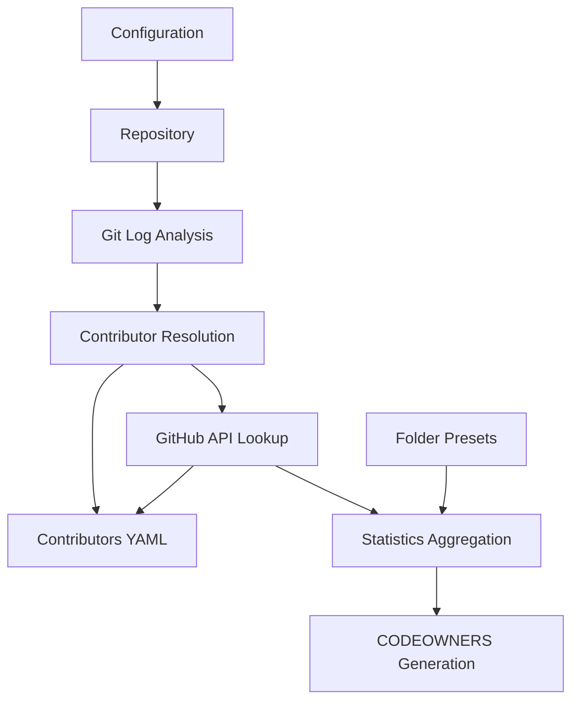

# CodeOwners Generator - Technical Documentation

A comprehensive tool for analyzing Git repositories to extract commit history, index contributors, summarize changes, and generate CODEOWNERS files automatically.

## Table of Contents
1. [Overview](#overview)
2. [Architecture](#architecture)
3. [Installation](#installation)
4. [Configuration](#configuration)
5. [Usage](#usage)
6. [Workflow](#workflow)
7. [Troubleshooting](#troubleshooting)
8. [API Reference](#api-reference)
9. [Maintenance](#maintenance)

## Overview

The CodeOwners Generator analyzes Git repositories to determine code ownership based on commit history and contributor activity. It uses the GitHub API to gather information about contributors and their commit patterns, then generates CODEOWNERS files that assign ownership to repository folders based on actual contribution data.

### Key Features
- **Automatic Contributor Discovery**: Identifies and resolves contributors from Git history
- **GitHub Integration**: Uses GitHub API to enrich contributor information
- **Flexible Folder Configuration**: Supports different folder types and ownership rules
- **Hierarchical Analysis**: Processes repository structure top-down
- **Rate Limit Handling**: Implements exponential backoff for API requests
- **Persistence**: Saves contributor data for incremental updates

## Architecture

The tool follows a multiphase processing approach:



### Core Components
- **AsyncGitHubRepoSummary**: Main analysis engine with GitHub API integration
- **ContributorCollection**: Manages contributor data and persistence
- **FolderSettings**: Handles folder type configuration and inheritance
- **Organization Classification**: Automatically categorizes contributors by organization

## Installation

### Prerequisites
- Python 3.8 or higher
- Git repository with commit history
- GitHub API access (optional but recommended)

### Quick Start
```bash
# Clone the repository
git clone <repository-url>
cd code-owners

# Install the package
pip install -e .

# Set up GitHub tokens (recommended)
export GITHUB_API_TOKENS="github_pat_XXXXX,github_pat_YYYYY"

# Run the tool
codeowners-cli --repo /path/to/repo --contributors-file contributors.yaml
```

### Building from Source
```bash
# Install build dependencies
pip install build

# Build the package
python -m build

# Install the built package
pip install dist/*.whl
```

## Configuration

### GitHub API Tokens

Without GitHub tokens, the tool is limited to 60 API requests per hour. For larger repositories, provide multiple tokens:

```bash
export GITHUB_API_TOKENS="token1,token2,token3"
```

**Token Requirements:**
- Fine-grained personal access tokens
- Public repository access (minimum)
- No additional scopes required

### Configuration Files

#### Contributors File (`contributors.yaml`)
Stores contributor information including:
- GitHub ID and login
- Email addresses (multiple per contributor)
- Organization affiliation
- Commit history and timestamps

**Example:**
```yaml
!Contributor
name: John Doe
emails:
  - john.doe@company.com
  - john.doe@gmail.com
github_id: 123456
github_login: johndoe
organization: MSFT
last_commit_ts: 2024-01-15 10:30:00+00:00
commit_count: 45
```

#### Folder Presets File (`folder_presets.yaml`)
Defines folder-specific settings:
- Folder types (IGNORE, CLOSED_OWNERS, OPEN_OWNERS, REGULAR)
- Pre-defined owners
- Inheritance rules

**Example:**
```yaml
/.git: !FolderSettings
  type: IGNORE
/tests/dash: !FolderSettings
  owners:
    - congh
    - nikamirrr
  type: CLOSED_OWNERS
/tests/ntp: !FolderSettings
  owners:
    - nikamirrr
  type: OPEN_OWNERS
```

## Usage

### Basic Usage
```bash
codeowners-cli --repo /path/to/repo --contributors-file contributors.yaml
```

### Advanced Configuration
```bash
codeowners-cli \
  --repo /path/to/repo \
  --contributors-file contributors.yaml \
  --folder_presets_file folder_presets.yaml \
  --active_after 2024-01-01 \
  --max_owners 5 \
  --log_level debug
```

### Output Example
```
CODEOWNERS output:
/ @owner1 @owner2 @owner3
/src/ @owner1 @owner4
/tests/ @owner2 @owner5
```

## Workflow

The CodeOwners Generator follows this workflow:

### Phase 1: Initialization
1. **Load Configuration**
   - Load existing contributors from `contributors.yaml` (if exists)
   - Load folder presets from `folder_presets.yaml` (if exists)
   - Scan repository structure and map folders to presets

2. **Repository Analysis**
   - Walk through repository directory tree
   - Identify all folders and their relationships
   - Apply preset configurations

### Phase 2: Commit Processing
1. **Extract Commit History**
   - Use `git log --numstat` to get commit statistics
   - Parse author information (name, email, timestamp)
   - Calculate change counts per folder

2. **Contributor Resolution**
   - Match commits to existing contributors by email
   - Query GitHub API for unknown contributors
   - Handle GitHub noreply emails (e.g., `29677895+user@users.noreply.github.com`)
   - Create bundled contributors for unresolved emails (`github_id: -1`)

### Phase 3: Analysis and Generation
1. **Folder Statistics**
   - For each active contributor (commits after `--active_after`)
   - Aggregate change statistics per folder
   - Propagate statistics up the folder hierarchy
   - Respect IGNORE and CLOSED_OWNERS folder types

2. **CODEOWNERS Generation**
   - Process folders top-down using depth-first search
   - Select top contributors up to `--max_owners` limit
   - Apply folder type rules (REGULAR, OPEN_OWNERS, CLOSED_OWNERS)
   - Generate hierarchical CODEOWNERS output

### Folder Type Processing Rules

| Type            | Description                | Behavior                                                          |
|-----------------|----------------------------|-------------------------------------------------------------------|
| `IGNORE`        | Skip folder and subfolders | Excluded from analysis, no statistics collected                   |
| `CLOSED_OWNERS` | Fixed owner set            | No new owners added, statistics still propagate to parent folders |
| `OPEN_OWNERS`   | Flexible owner set         | New owners can be added up to `--max_owners` limit                |
| `REGULAR`       | Default type               | Standard analysis and ownership assignment                        |

## Troubleshooting

### Common Issues

#### Rate Limiting
**Problem:** "GitHub rate limit exceeded" errors
**Solution:** 
- Add GitHub API tokens: `export GITHUB_API_TOKENS="token1,token2"`
- Use multiple tokens for larger repositories
- The tool implements exponential backoff automatically

#### Missing Contributors
**Problem:** Contributors with `github_id: -1`
**Solution:**
- Review `contributors.yaml` for duplicate emails
- Manually merge contributor records
- Re-run the tool

#### Performance Issues
**Problem:** Slow processing on large repositories
**Solution:**
- Increase number of GitHub tokens
- Use `--active_after` to limit commit history
- Consider using `--max_owners` to reduce processing

#### SSL/TLS Issues
**Problem:** Certificate verification errors
**Solution:**
- The tool uses `certifi` for certificate validation
- Ensure system certificates are up to date
- Check network proxy settings if applicable

### Debug Mode
Enable debug logging to troubleshoot issues:
```bash
codeowners-cli --repo /path/to/repo --log_level debug
```

## API Reference

### Command Line Options

| Option                  | Type   | Default             | Description                                  |
|-------------------------|--------|---------------------|----------------------------------------------|
| `--repo`                | string | required            | Path to Git repository                       |
| `--contributors_file`   | string | `contributors.yaml` | Contributors database file                   |
| `--folder_presets_file` | string | none                | Folder configuration file                    |
| `--active_after`        | date   | 730 days ago        | Consider contributors active after this date |
| `--max_owners`          | int    | 3                   | Maximum owners per folder                    |
| `--log_level`           | string | `info`              | Logging level (debug, info, warning, error)  |

### Environment Variables

| Variable            | Description                   | Example                             |
|---------------------|-------------------------------|-------------------------------------|
| `GITHUB_API_TOKENS` | Comma-separated GitHub tokens | `github_pat_XXXXX,github_pat_YYYYY` |

### Logging Levels

| Level     | Description                | Use Case                  |
|-----------|----------------------------|---------------------------|
| `debug`   | Detailed debug information | Troubleshooting           |
| `info`    | General information        | Normal operation          |
| `warning` | Warning messages           | Rate limiting, API issues |
| `error`   | Error messages only        | Production monitoring     |

### Rate Limiting Behavior

The tool implements intelligent rate limiting:
- **Exponential Backoff**: Wait time doubles on rate limit hits
- **Token Rotation**: Randomly selects from available tokens
- **Queue Management**: Queues commits for processing
- **Worker Pool**: Uses multiple workers for parallel processing

## Maintenance

### Regular Tasks

#### 1. Review Contributors File
- Check for contributors with `github_id: -1`
- Merge duplicate email addresses
- Update organization affiliations
- Remove inactive contributors if needed

#### 2. Update Folder Presets
- Add new folders that need special handling
- Adjust owner assignments
- Review IGNORE folder settings
- Update organization-specific rules

#### 3. Monitor GitHub API Usage
- Check rate limit status in logs
- Rotate API tokens as needed
- Monitor for new contributors
- Adjust token count based on repository size

### Best Practices

#### For Large Repositories
- Use multiple GitHub tokens (3-5 recommended)
- Set appropriate `--active_after` dates
- Consider running during off-peak hours
- Monitor memory usage for very large repositories

#### For Multi-Organization Projects
- Review organization classifications regularly
- Update email domain mappings as needed
- Consider organization-specific folder presets
- Monitor for new organization patterns

#### For Active Development
- Run the tool regularly (weekly/monthly)
- Keep contributor data up to date
- Review CODEOWNERS output before committing
- Coordinate with team leads on ownership changes

### Data Management

#### Backup Strategy
- Version control your `contributors.yaml` file
- Keep backups of folder presets
- Document any manual contributor merges
- Track changes to organization mappings

#### Cleanup Procedures
- Periodically review and remove inactive contributors
- Consolidate duplicate contributor records
- Archive old folder presets
- Clean up unused organization mappings

---

**Version:** 0.0.4  
**Last Updated:** 2024  
**Maintainer:** Development Team

